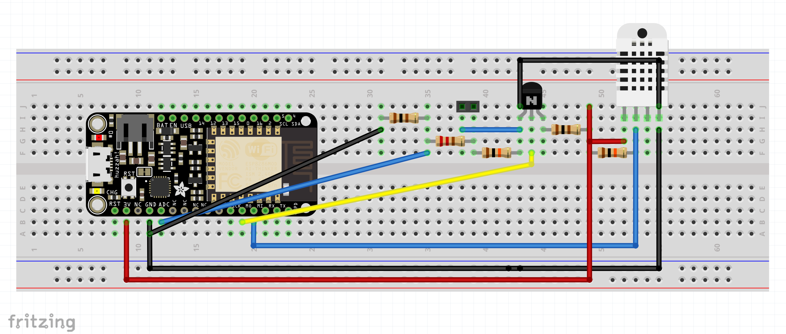
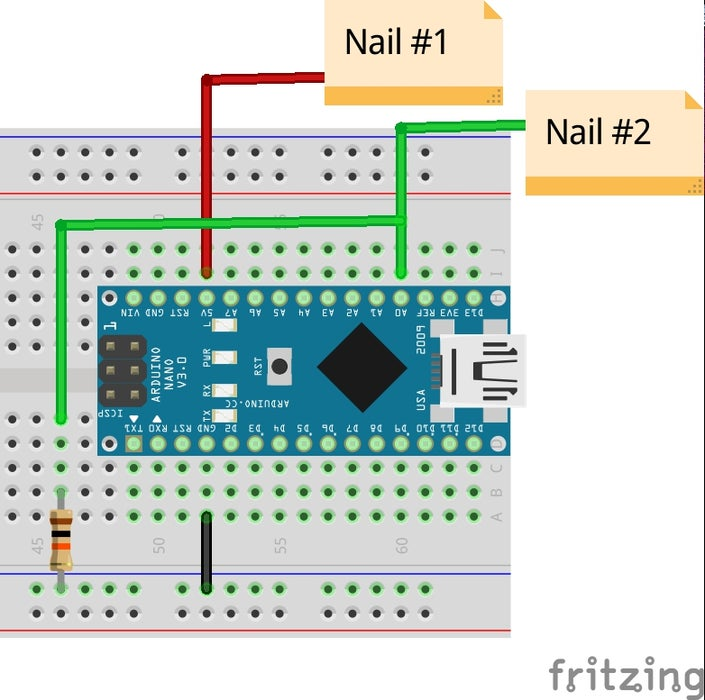
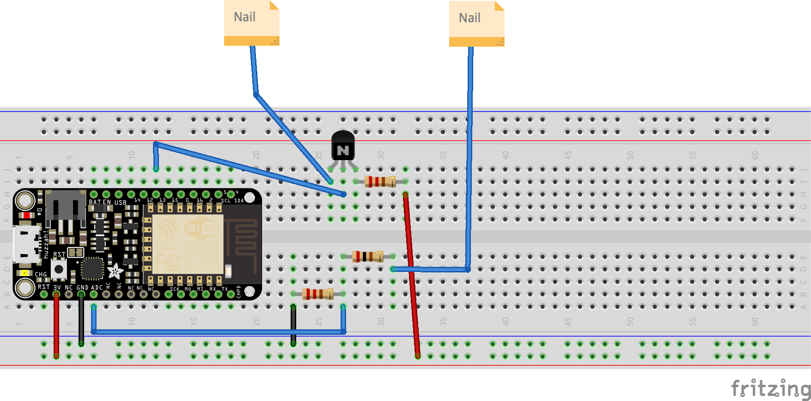
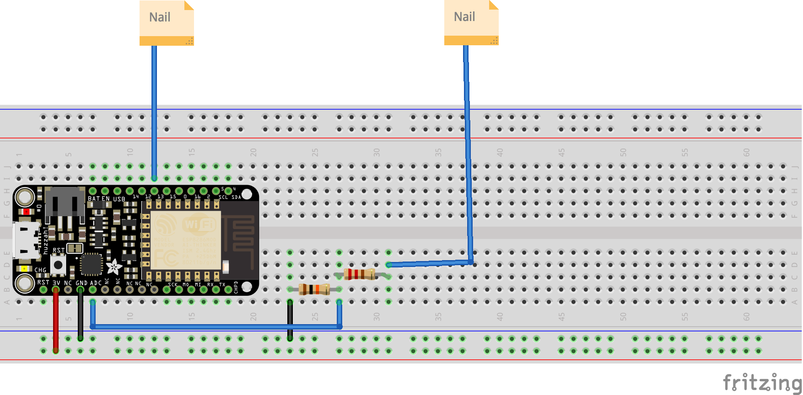

#Building a Plant Monitor for Soil Moisture and Ambient Conditions
## Introduction
A plant monitor can be used to sense the conditions of a plant, providing insight into when it would best be watered, and whether the ambient conditions match those which suit the plant. It can also serve as the foundation to be developed further into a “plant robot”, by adding actuators that use the sensor’s data to auto-water the plant [TODO: find source for this and an image], or move the plant towards the sun conditions that the plant thrives best in [TODO: find MIT media lab source and video clip].

This particular plant monitor is used to track the ambient humidity and temperature along with the soil moisture to provide information to the plant gardener as to when the plant should be watered, and if the plant should be moved to a different space.

The plant, [TODO: find name of plant plus details of where it best grows], requires the following conditions:
[TODO: find out info about power consumption]
## Documentation

### Items Needed
- Feather Huzzah ESP8266 WiFi
- Raspberry Pi
- 2 Nails
- Jumper cables
- Additional cabling for the nails + electrical tape (say .5m per nail)
- Plant for monitoring
- (Optional) PN222 Transistor
- DHT22 Temperature-Humidity sensor
- [ ] finish out list of the hardware needed for the development of the project]

### Software
#### Installations
1.	Download and install Arduino IDE [TODO: Add hyperlink] and MQTT Explorer [href]
2.	Set up a GitHub repo for the project [hyperlink]
3.	Launch Arduino IDE and Huzzah into USB port
4.	Add board via board manager if unrecognised, following instructions on the Adafruit website [hlink]
#### Adapting and running examples to ensure board is working
1.	Run the blink example [hlink] to ensure the board is working
2.	The testHTTP [href] code can be used to test the WiFi connection on the Arduino board. Fill in the ssid, password to match your WiFi network. 
3.	Upload the code to the board (using the right arrow in the top left) and open the Serial Monitor (at the top right) to check that the device is able to connect to WiFi.and the web client.
4.	Test that the board can get the time data from the internet. Edit the testEztime code againby filling in the ssid and password, and again upload the script to the board and open the Serial monitor.
5.	Test that the MQTT calls of publish and subscribe can be sent by the board with testMQTT. Create an “arduino_secrets.h” file populated using the syntax described in the file. Ensure that this file is ignored by Git [href]. Search for the “client.publish” and “client.subscribe” lines and change the topic arguments if you wish. Again upload the file to the board.
6.	To test this source code, open up MQTT Explorer, creating a connection to the mqtt.cetools.org host under port 1884. Type in the same username and password as you entered into the secrets file. You should observe a “hello world” message that is listed under the topic which you set in the previous step.
7. To test that the "subscribe" functionality is working properly, use the "publish" pane of MQTT Explorer. Fill in "Topic" with the argument in the client.subscribe command of the reconnect() method, select "raw" as the data type, and type a 1 in the box. Click "publish". The built-in LED on your board should light up. If you type 0 in the box and click "publish" again, the LED should turn off.
### Hardware

To integrate the DHTT final circuit requires a more complex circuit:

  
    <em>Plant monitor: integrated DHT22 and moisture sensor (Wilson, 2021)</em>

Test that your sensor is giving you sensible data by running the `testMoisture` script. Change the values as listed in the GitHub readme.

Now make the readme-described changes to `DHT22_MQTT_with_nails`.

####Raspberry Pi

1. Download the Raspberry Pi Imager [https://www.raspberrypi.com/software/], and set up the device using the following tutorial on a MicroSD card plugged into your computer: [https://www.tomshardware.com/uk/reviews/raspberry-pi-headless-setup-how-to,6028.html]. Choose a meaningful hostname.
2. Insert card into a computer and type: `ssh pi@[hostname].local`
3. Bring all files up to date: `sudo apt update; sudo apt upgrade -y; reboot`
4. Add InfluxDB key: `wget -qO- https://repos.influxdata.com/influxdb.key | sudo apt-key add -`
5. Store debian repository in sources list, update and install InfluxDB: `echo "deb https://repos.influxdata.com/debian buster stable" | sudo tee /etc/apt/sources.list.d/influxdb.list ; sudo apt update; sudo apt install influxdb`
6. Get influx started at reboot: `sudo systemctl unmask influxdb.service; sudo systemctl start influxdb; sudo systemctl enable influxdb.service`
7. Open the InfluxDB CLI: `influx`
8. Type in the below queries:
> CREATE DATABASE telegraf
> USE telegraf
> CREATE USER admin WITH PASSWORD 'admin' WITH ALL PRIVILEGES
> GRANT ALL PRIVILEGES ON telegraf TO admin
> SHOW USERS
> exit
9. Download telegraf: `wget https://dl.influxdata.com/telegraf/releases/telegraf_1.19.2-1_armhf.deb` [Note: use a different version depending on the Raspberry pi you are using]
10. Install: `sudo dpkg -i telegraf_1.19.2-1_armhf.deb`
11. Edit `/etc/influxdb/influxdb.conf` with root-privileges so that `enabled = true`, `bind-address = ":8086"` and `auth-enabled = true`.
12. Restart influxdb: 
`sudo systemctl stop influxdb;
sudo systemctl start influxdb`
13. Install grafana to allow data visualisation: 
>sudo apt-get install -y adduser libfontconfig1
wget https://dl.grafana.com/oss/release/grafana_8.1.1_armhf.deb
sudo dpkg -i grafana_8.1.1_armhf.deb
14. Get grafana running:
>sudo /bin/systemctl daemon-reload
sudo /bin/systemctl enable grafana-server
sudo /bin/systemctl start grafana-server
15. Going to `hostname.local:3000`, you should see the Grafana website. Insert a default username and password of `admin admin`.
16. Replace the telegraf configuration with a simpler file: `cd /etc/telegraf ; sudo systemctl stop telegraf ; sudo mv telegraf.conf telegraf.conf.backup ; sudo wget https://raw.githubusercontent.com/ucl-casa-ce/casa0014/main/plantMonitor/pi/etc/telegraf/telegraf.conf`
17. Edit the `servers` and `topics` to match those where your data is getting published to.
18. Start telegraf and check for errors. 
> sudo systemctl start telegraf.service
sudo systemctl status telegraf.service
19. Add your first data source by following the onscreen prompts, select `InfluxDB`, add `localhost:8086` at the URL, add `telegraf` as the database and fill out your username and password, click `save and test`
20. Create a dashboard from the '+' symbol on the left sidebar. Click 'Empty Panel'.
21. From the Query panel, select `mqtt_consumer` in the `From` row. It should appear after typing a few letters.
22. Now in the `GROUP BY` row, select `tag(topic)`. This will split temperature, humidity, and moisture.

#Reflection

Now that the sensor is set up,

The soil moisture circuit consists of an electrolytic cell: a charge is propagated between two metallic electrodes (in this case two nails) via a conductive electrolyte (in this case the soil) (Atkins, de Paula, and Keeler, 2018). Please see below for a Fritzing diagram of the fundamental layout.

  
    <em>Basic moisture sensor circuit (Tucker, 2015)</em>

 When the separating soil's moisture rises, the resistivity of the soil drops. By connecting the analog input pin before an additional 10K resistor, a voltage divider is created, and the following formula can describe the circuit:
 
 where  represents the 5V input voltage,  represents the analog voltage measurement,  is the 10K resistor and  is the proxy-resistor created by the nail-soil-nail connection (https://www.arduino.cc/en/Tutorial/BuiltInExamples/AnalogInput). In short, a high measured voltage will correspond to a high soil conductivity and therefore high soil moisture.

[Reflection] While the basic circuit described above would function without issue for a time, the underlying electrolysis reaction that occurs when power is sent to the first nail leads to corrosion and increasing uncertainty in the moisture measurements. To preserve the device, it is therefore best to only send power through the nails when a reading is needed. [TODO: only take moisture readings once an hour or when a request is sent from MQTT.] There are a couple of ways to do this. The approach used in this iteration of the plant monitor makes use of a transistor, whose middle pin is linked to a digital pin to turn the sensor on and off. It also requires an additional resistor between the nail and the analog input to bring the maximum voltage down to 1V, based on the board's analog input standards.

  
    <em>Moisture sensor circuit enabled by transistor</em>

[Reflection] However, I believe a more lightweight (and potentially resilient) solution could be achieved by instead turning the powered nail on and off with a digital pin set to output. This would remove the need for a transistor.

  
    <em>Moisture sensor circuit powered by digital pin</em>

